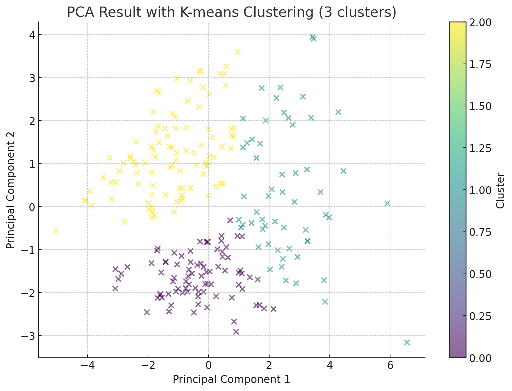
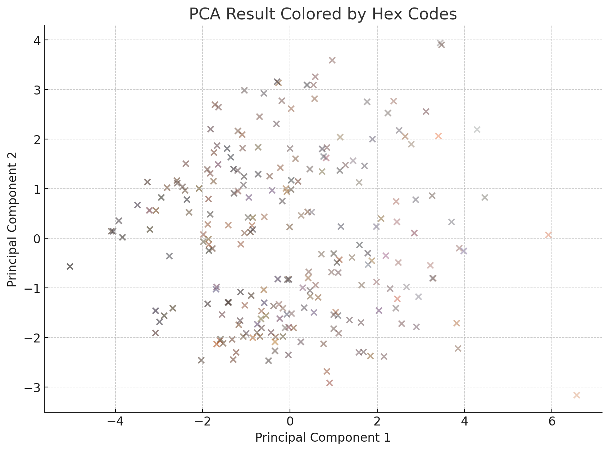

# fpr_scale
 Piloting the development of a Fitzpatrick scale analogue for intraocular pigmentation

## Description
This quick project aims to determine if fundus color can be separated into clinical meaningful groups using clustering analysis.

## Instructions
 1) pre_process.py
    - Removes black borders from fundus images and returns a PNG with a transparent background

    
    

 2) main3_V1.3_png_wout_border_noblack.py
    - Extracts dominant colors from fundus images, filters out black
    - Returns file with RGB values (and count) per dominant color, per image
    - Ensure to remove alpha channel if using PNGs w/ transparent elements

    

 3) rearrange.py
    - Spreads dominant_colors.csv into single row entries (per image)
    - [Merge](merge.py) [patient data](results/merged_zip_information.csv) with the [rearranged data](results/post_processed/Normal/rearranged_rgb_values.csv) [if desired](results/post_processed/Normal/merged_data.csv)

    

 4) recode.py
    - If including non-numerical data, this will need to be recoded before analysis
    - This script will encode eye side and gender as 0 and 1
 
 The data is now ready for cluster analysis. Specific dimensions can be included or excluded from analysis. [After labelling](results/clustered_output.xlsx), you can plot. For example:

 
 

## Next Steps and Considerations
- EXIF metadata will allow us to control for inconsitencies among images, and isolate pigmentation
- Considering demographic data, eye side, age, and weight could be informative in cluster analysis. Inclusion of disease information (pathology, severity, etc.) will increase clinical relevancy (maybe?)
- Associations between clusters and specific dimensions should be investigated (i.e., color, demographics, etc.)
- Other means of clustering should be investigated, including bootstrapping methods, unsupervised machine learning methods, or alternate means of thresholding

Sorry about the excel files, I will fix scripts to output CSV only later. 

## Dependencies
 - numpy
 - opencv
 - scikit-learn
 - matplotlib
 - seaborn
